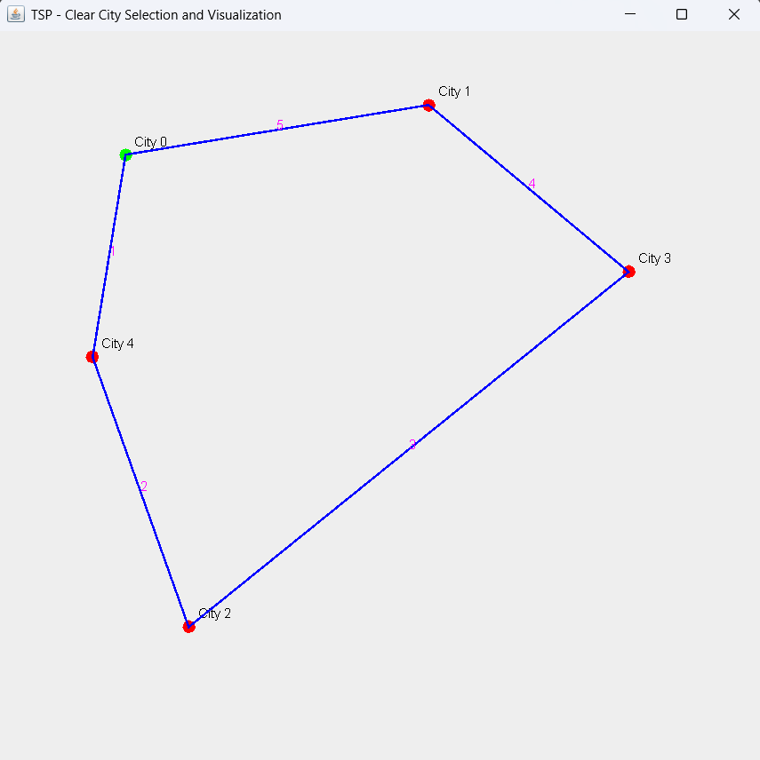

# TSP Visualization

This project is a Java Swing application that demonstrates the Traveling Salesman Problem (TSP) using the Nearest Neighbor algorithm.

---

## Features
- Enter number of cities
- Click to place cities on screen
- Visual path representation
- Displays TSP route automatically

---

## How to Run

Compile:
javac TSPGuiUserInput.java

Run:
java TSPGuiUserInput

---

## Algorithm
Nearest Neighbor:
- Start from first city
- Visit nearest unvisited city
- Repeat until all cities are covered
- Return to starting city

---

## Output

---

## Author
Karthik Naidu
